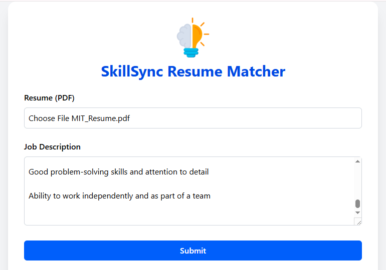
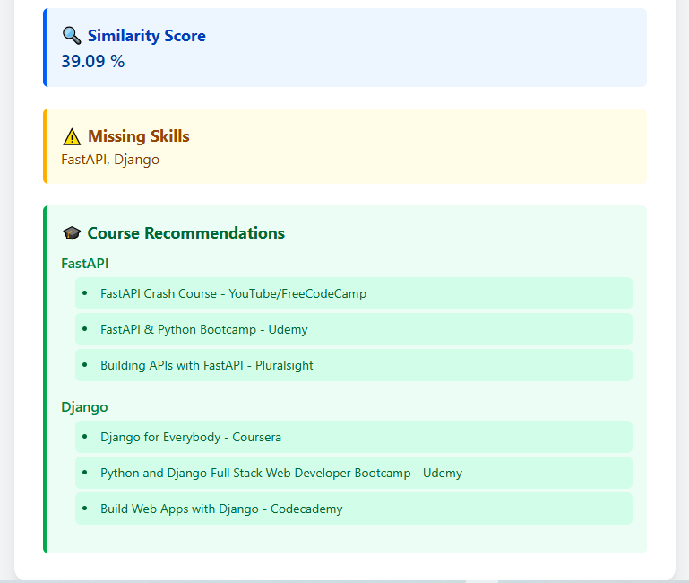

# SkillSync

<p align="center">
  
</p>

<h1 align="center">SkillSync</h1>

<p align="center"><em>AI-powered resume matcher and personalized upskilling platform</em></p>

**SkillSync** is an intelligent platform that uses machine learning to automatically match resumes with job descriptions and recommend personalized learning resources. The goal is to help job seekers optimize their skill set and increase their chances of landing the right job by identifying skill gaps and suggesting targeted courses or tutorials.

---

## Table of Contents

- [Project Overview](#project-overview)
- [Features](#features)
- [Tech Stack](#tech-stack)
- [Getting Started](#getting-started)
- [Usage](#usage)
- [API Endpoints](#api-endpoints)
- [Contributing](#contributing)
- [License](#license)
- [Contact](#contact)

---

## Project Overview

SkillSync leverages Natural Language Processing (NLP) and machine learning models to analyze the content of resumes and job descriptions. It extracts key skills, compares them, and generates recommendations for learning resources that help users bridge their skill gaps.

---

## Features

- **Resume and Job Description Parsing:** Extract key skills and relevant information using NLP techniques.
- **Automated Skill Matching:** Compare user resumes against job requirements.
- **Personalized Learning Recommendations:** Suggest targeted courses and tutorials based on missing or weak skills.
- **User Profiles:** Manage resumes, track progress, and store preferences.
- **Interactive Dashboard:** Visualize matching scores, skill gaps, and recommended learning paths.
- **RESTful API:** Backend services for integration with frontend or third-party apps.

---

## Tech Stack

- **Frontend:** Next.js (React)
- **Backend:** Node.js (Express)
- **Database:** MongoDB
- **Machine Learning:** HuggingFace Transformers (BERT embeddings for semantic similarity)
- **Authentication:** JWT-based auth
- **Deployment:** Docker (optional)

---

---

## 🖥️ UI Preview

Here’s what SkillSync looks like in action:

<p align="center">
  
  <br/>
  <em>Dashboard: Visualizing resume-job match, skills gaps, and learning recommendations</em>
</p>

<p align="center">
  
  <br/>
  <em>Smart learning suggestions based on missing skills</em>
</p>

## Getting Started

### Prerequisites

- Node.js >= 16.x
- MongoDB >= 4.x
- npm or yarn package manager
- Python (for ML model if separate service)
- Git

### Installation

1. Clone the repo
   ```bash
   git clone https://github.com/TUBUNJANA/SkillSync.git
   cd SkillSync
   ```
